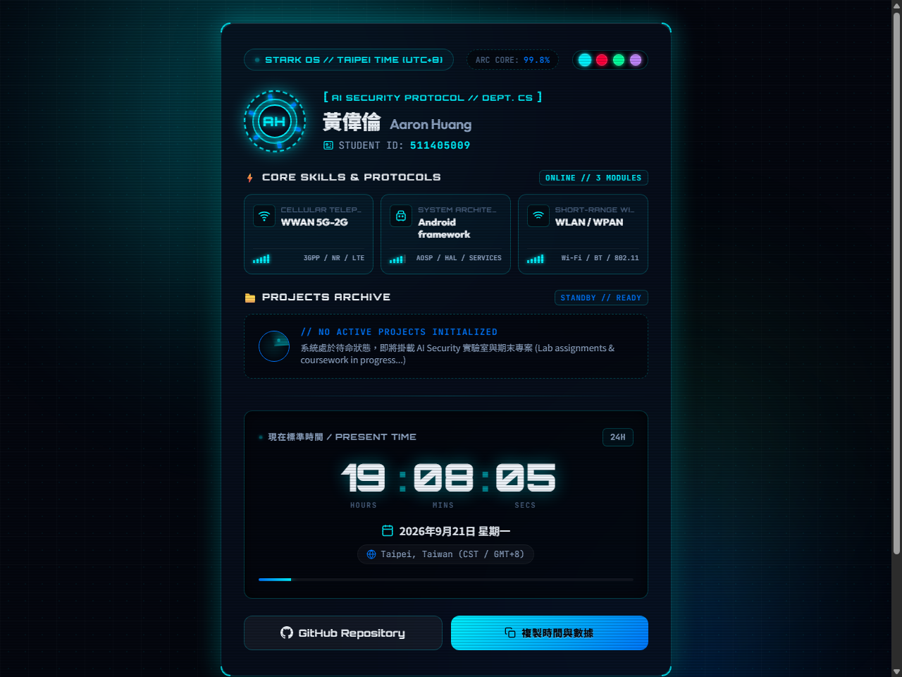

# AI Security - Lab 02 (L02)

This directory contains the coursework, lab exercises, and interactive interface for **Lab 02** in the **AI Security** course.

[](https://aaronh945.github.io/AI_Security_HW/L02/)

---

## 🌐 Live Demo & Interactive Module

- **Live URL**: [https://aaronh945.github.io/AI_Security_HW/L02/](https://aaronh945.github.io/AI_Security_HW/L02/)
- **Main Hub**: [https://aaronh945.github.io/AI_Security_HW/](https://aaronh945.github.io/AI_Security_HW/)
- **Features**: STARK HUD Sci-Fi Interface, Real-time Taipei Clock (UTC+8), Armor Energy Theme Switcher, and Lab 02 Telemetry.



---

## 📂 Directory Structure

```text
L02/
├── index.html        # Lab 02 Interactive Interface
├── style.css         # Sci-Fi UI Styling & Themes
├── app.js            # Real-time Clock & Telemetry Logic
├── screenshot.png    # Lab 02 Preview Screenshot
└── README.md         # Lab 02 Documentation
```

---

## 📝 License

This project is for educational and coursework purposes.
