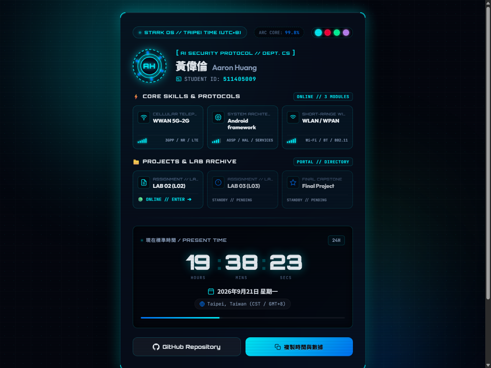

# AI Security Coursework & Homework (AI_Security_HW)

This repository contains homework assignments, lab exercises, and projects for the **AI Security** course.

[](https://aaronh945.github.io/AI_Security_HW/)

---

## 🌐 Live Demo & Interactive Hubs

| Section | Description | Live Demo URL |
| :--- | :--- | :--- |
| **Main Portal** | STARK HUD Navigation Hub & Student Portfolio | [Visit Main Hub](https://aaronh945.github.io/AI_Security_HW/) |
| **Lab 02 (L02)** | Lab 02 Interactive Interface & Telemetry | [Visit Lab 02](https://aaronh945.github.io/AI_Security_HW/L02/) |
| **Lab 03 (L03)** | CWA 台灣氣象站地圖 & PostgreSQL 系統 | [Visit Lab 03](https://aaronh945.github.io/AI_Security_HW/L03/) |
| **Final Project** | Capstone Final Project Hub | *Standby / Pending* |



---

## 📂 Repository Structure

```text
AI_Security_HW/
├── index.html        # STARK HUD Main Portal & Directory
├── style.css         # Sci-Fi UI Styling & Themes
├── app.js            # Real-time Clock, Telemetry & Theme Switcher
├── screenshot.png    # Portal Preview Screenshot
├── package.json      # Dependencies (pg for PostgreSQL)
├── vercel.json       # Vercel Deployment & Cron Configuration
├── README.md         # Main Project Overview & Documentation
│
├── api/              # Vercel Serverless Functions
│   ├── weather.js    # Weather query endpoint (PostgreSQL / CWA Fallback)
│   └── sync.js       # CWA to PostgreSQL sync & Cron handler
│
├── lib/              # Backend Modules
│   ├── db.js         # PostgreSQL connection & Auto-schema
│   └── cwa.js        # CWA Open Data fetcher & parser
│
├── L02/              # Lab / Homework 02
│   ├── index.html    # Lab 02 Dedicated Interface
│   ├── style.css     # Lab 02 Styling
│   ├── app.js        # Lab 02 Script
│   ├── screenshot.png# Lab 02 Preview Screenshot
│   └── README.md     # Lab 02 Overview
│
├── L03/              # Lab / Homework 03 (CWA Weather Station Map)
│   ├── index.html    # Leaflet 台灣氣象站地圖
│   ├── style.css     # HUD 樣式與溫度色階
│   ├── app.js        # 地圖 Marker 渲染與遙測邏輯
│   ├── taiwan-counties.json # 台灣行政區 GeoJSON
│   ├── screenshot.png# L03 預覽截圖
│   ├── sql/schema.sql# PostgreSQL DDL
│   └── README.md     # L03 文件與部署步驟
│
└── Final/            # Final Capstone Project
```

## 📝 License

This project is for educational and coursework purposes.
